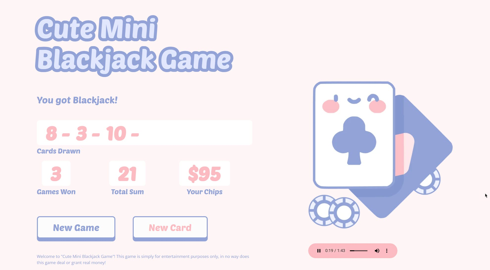

# Cute Mini Blackjack Game

This repository contains a fun, interactive, and simplified version of the classic card game, Blackjack, implemented in JavaScript. The game is designed to be user-friendly and engaging, making it a great way to pass the time and challenge your decision-making skills.

In this game, players draw cards with the aim of getting as close to 21 as possible without going over. The game includes features such as card drawing, score calculation, and win/loss detection. Whether you're a seasoned Blackjack player or new to card games, you'll find this Cute Mini Blackjack Game enjoyable and engaging.

Feel free to explore the code, suggest improvements, or fork the repository to create your own version of the game. Happy gaming!

